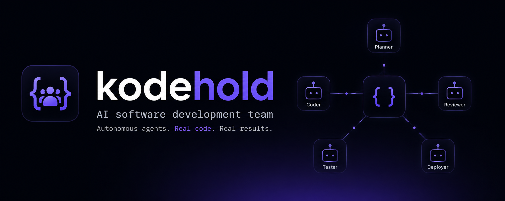

> **⚠️ WORK IN PROGRESS — EXPERIMENTAL**
> KodeHold is a personal experiment and **not production-ready**. Everything may change. Use at your own risk — expect breaking changes, unexpected behavior, and gaps in documentation. If it breaks, you keep both pieces.

# KodeHold — /ˈkəʊd həʊld/ → "Code Hold". Koden er i gode hænder.

**AI-powered coding orchestrator** — conscious team-based software engineering with structured design documents, persistent memory, lifecycle gates, and multi-LLM support.

KodeHold simulates a disciplined software organization where specialized AI agents collaborate under a Director to produce high-quality code. Every project is centered on a living design document that is continuously reviewed and updated throughout development.

## Philosophy

- **Design-first** — no code without an approved design document
- **Separation of concerns** — distinct teams for design, implementation, review, testing, memory, and front-line support
- **Token-conscious** — every operation evaluated for token cost; RTK for compact CLI output
- **Persistent memory** — full project context preserved across sessions via file-based storage (`.opencode/memory/`) and OpenCode RAG (`search_semantic`, `find_usages`)
- **Traceable decisions** — all architecture decisions recorded as ADRs (Nygaard format)
- **LLM-agnostic** — bring your own model; second-opinion cross-check supported via different providers
- **Gate-driven lifecycle** — every state transition validated by automated gates; no skipping steps
- **Design doc discipline** — all agents read the design doc before work and update it after

## Architecture

```
Director                        ← orchestrator, lifecycle gates, delegation, second opinions
├── Architects   — design documents, ADRs, technology evaluation
├── Engineers    — implementation, refactoring, bug fixes
├── Testers      — testing, verification, regression suites
├── Reviewers    — code review, design review, second opinion coordination
├── Scribes      — documentation, `.opencode/memory/`, knowledge extraction
└── FLS          — front line support, triage, hotfix, escalation
```

### Lifecycle

```
INIT → ACTIVE → REVIEW → CLOSED ↔ REOPEN
```

| State | Description |
|-------|-------------|
| INIT | Design doc created, ADRs drafted, project scoped |
| ACTIVE | Implementation — Engineers → **Testers** → **Reviewers** (sequential, enforced) |
| REVIEW | Final gate — Team Meeting reviews all work across all 6 teams |
| CLOSED | Complete, context stored in `.opencode/memory/` and design docs |
| REOPEN | Resurrected for new features or bugfixes |

Each transition runs automated gates via `scripts/gate.sh`. Agents check state before work and refuse if in the wrong phase. The ACTIVE→REVIEW gate enforces that Testers complete before Reviewers begin (`.testers_done` marker).

### Design Doc Discipline

All agents follow **read-before, update-after**:
1. **Read** the relevant design document section before starting any work
2. **Update** the design doc after completing work — bump version, changelog, and relevant sections
3. The Director verifies the design doc is current before any gate transition

## Teams

| Team | Trigger | Sequence |
|------|---------|----------|
| Architects | Design, ADR, architecture, design review | — |
| Engineers | Implementation, code, feature, bugfix, refactor | — |
| Testers | Test, verify, regression, QA | Must finish before Reviewers |
| Reviewers | Review, code review, design review | Must run after Tests pass |
| Scribes | Memory (`.opencode/memory/`), documentation, changelog | — |
| FLS | Support, hotfix, triage, minor change | — |

## Workspaces

Managed projects live in `workspaces/<name>/`:
- `bash scripts/workspace.sh init <name>` — create a new project
- `bash scripts/workspace.sh list` — list all projects with state
- `bash scripts/workspace.sh gate <name> <transition>` — run gate on a project
- `bash scripts/workspace.sh deploy-ready <name>` — check if CLOSED

## Second Opinion

For critical decisions, the Director can request a second opinion from a **different AI provider** (e.g., Claude if primary is Codex). Falls back to user prompt via `/models` or `/connect` if no secondary provider is configured.

## Quick Start

```bash
# Prerequisites: OpenCode, RTK v0.40+
git clone https://github.com/Acharnite/kodehold.git
cd kodehold
opencode
```

The Director agent loads automatically as the default agent. Start by reading `AGENTS.md` for the full protocol and delegation table.

## Documentation

| Path | Description |
|------|-------------|
| `AGENTS.md` | Quick reference — states, delegation table, gates, shipping gate |
| `docs/design/README.md` | Main design document — full architecture, lifecycle, constraints |
| `docs/adr/` | Architecture Decision Records (ADR-0001 through ADR-0025) |
| `.opencode/agents/director.md` | Director agent — full orchestrator protocol |
| `.opencode/agents/` | Team agent definitions (7 agents) |
| `scripts/gate.sh` | Lifecycle gate automation (5 transitions) |
| `scripts/ship.sh` | Shipping gate automation (7 checks: version → changelog → todo → tests → git → branch) |
| `scripts/workspace.sh` | Workspace project management |
| `tests/run.sh` | Test suite — 12 tests across smoke, init, integration |

## Requirements

- **OpenCode** — agent framework

- **RTK** v0.40+ — token-optimized CLI (`pip install rtk`)
- **Ollama** or another LLM provider

All configs and functions are in English for token efficiency.
